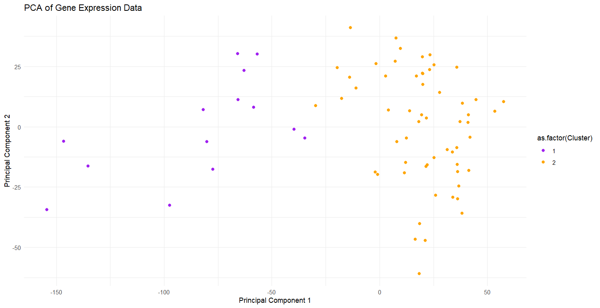
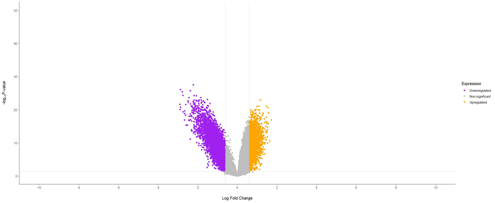
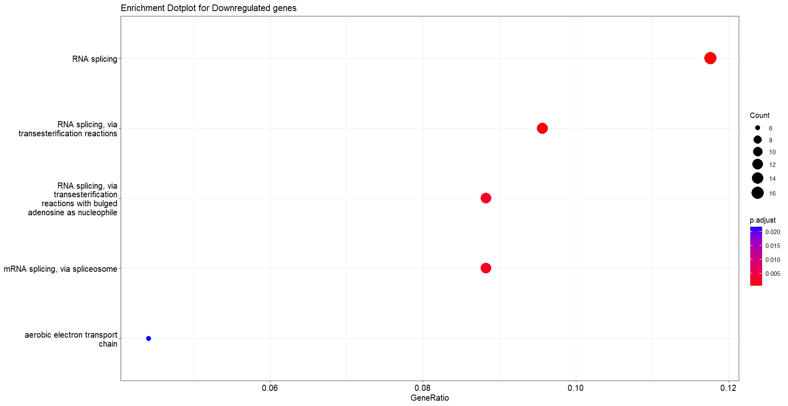

# Transcriptomic DEG Analysis Workflow — TNBC Case Study

## Objective
To design and implement a reproducible workflow for differential gene expression (DEG) analysis of transcriptomic data, demonstrated using Triple Negative Breast Cancer (TNBC) microarray datasets.

## Data Source
Publicly available gene expression datasets obtained from the Gene Expression Omnibus (GEO).

## Workflow Overview

1. Data retrieval and preprocessing from GEO
2. Z-score standardization of expression values
3. Dimensionality reduction using Principal Component Analysis (PCA)
4. Unsupervised clustering using k-means
5. Differential expression analysis using Limma (R/Bioconductor)
6. Functional enrichment analysis using GSEA (EnrichGO)
7. Visualization of expression patterns and results
8. Protein–Protein Interaction analysis and hub gene identification using STRING database

## Tools & Environment

- R / RStudio
- Limma (Bioconductor)
- EnrichGO package
- PCA and clustering methods in R
- STRING database (web-based)

## Key Outputs

- Identification of differentially expressed genes in TNBC samples
- Enriched biological pathways associated with TNBC
- Candidate hub genes based on protein interaction networks
- Visualizations including PCA plots, clustering outputs, and DEG summaries

## Skills Demonstrated

- Transcriptomic data preprocessing and normalization
- Unsupervised learning techniques for biological data
- Statistical modeling for gene expression analysis
- Pathway enrichment analysis
- Integrative interpretation of multi-step genomic workflows

## Key Visualizations

### PCA Plot

### Volcano Plot

### Enriched Downregulated Pathways

### Enriched Upregulated Pathways
## Key Visualizations

### PCA Plot

### Volcano Plot

### Enriched Downregulated Pathways

### Enriched Upregulated Pathways

